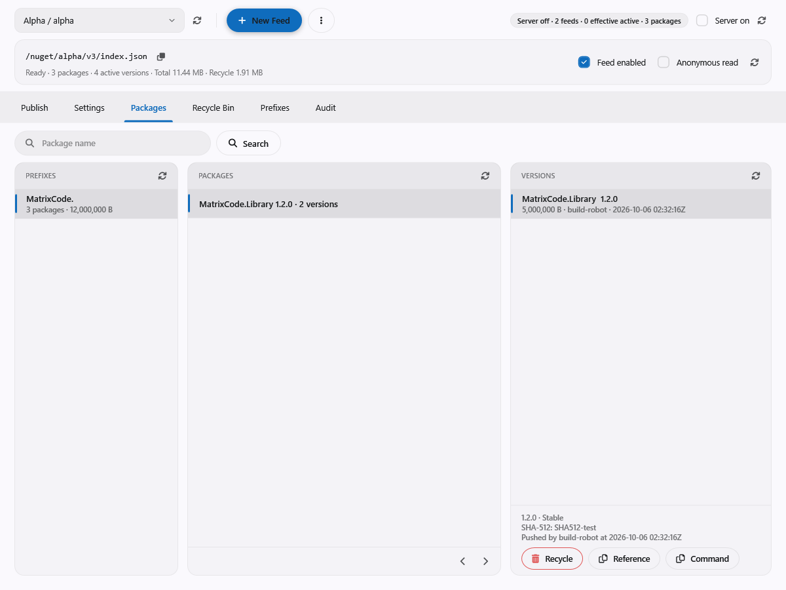

# NuGet server (NuPak)

The API host can serve independent NuGet V3 feeds at `/nuget/{slug}/v3/index.json`. The WPF **NuGet
Manager** (`admin.nupak`) manages feeds, packages, prefixes, robot access, the recycle bin and the audit
log. An installation starts with **zero feeds**; there is no built-in feed.



## Host setup

API host (`Program.cs`):

```csharp
builder.AddManagedStorageSettings();
builder.AddNuPak();                       // managed: directory and size limit from the Settings card
// or, without managed storage settings:
// builder.AddNuPak("./data/nuget", maxPackageMb: 250);
```

- Managed mode defaults to enabled, `./data/nuget` and 250 MB (1–4096). Changing them in the NuGet
  Settings card requires an API restart. With the store disabled there is no protocol endpoint.
- In static mode the relative path resolves from the content root and is created at startup.
- `AddNuPak` may be called once. Removing it removes both the feed endpoint and the management actions.

Database: run `doc/sqlscript/mssql/tables/040-nupak.sql` on the core database after the core schema
(`010-core.sql`), then the five `doc/sqlscript/mssql/views/vi_NuPak*.sql` files. Startup requires the schema
marker `ta_Meta.NuPakSchemaVersion=2`, validates the tables before store recovery, and never migrates
automatically.

WPF host: nothing to register. The NuGet Manager navigation is part of `Em.Ui.Wpf.Core`.

## Server and feed switches

- The **server** switch (`NuPakEnable`) defaults to off. Turning it off keeps all data and leaves the
  manager available; every feed request then returns 404.
- New **feeds** start disabled and private. Enable the feed and the server separately.
- **Anonymous read** is per feed. Wrong credentials still return 401, even on an anonymous feed.
- A disabled server or feed returns 404 before authentication.
- Server and feed settings are read from committed database metadata and apply to new requests
  immediately.

## Publishing and consuming packages

1. In NuGet Manager, create and select a feed, then create a prefix such as `MatrixCode.`. A package must
   match an active prefix before it can be pushed. The longest matching prefix owns new package IDs;
   adding a more specific prefix later does not move existing packages.
2. In **User Manager → Robots**, create a robot and grant NuGet access per **Feed / Prefix**: **R** restores;
   **W** restores, pushes and deletes into the recycle bin. Robot ownership does not inherit user rights or
   access to other feeds. Keep the token private.
3. Enable the feed and the server.

Use HTTPS in production. For local HTTP, opt in with `allowInsecureConnections`. Package source mapping
ensures private IDs resolve only through your feed. Replace `MatrixCode.*` with your prefix.

```xml
<?xml version="1.0" encoding="utf-8"?>
<configuration>
  <packageSources>
    <clear />
    <add key="Em" value="http://localhost:5132/nuget/alpha/v3/index.json" allowInsecureConnections="true" />
  </packageSources>
  <packageSourceMapping>
    <packageSource key="Em"><package pattern="MatrixCode.*" /></packageSource>
  </packageSourceMapping>
</configuration>
```

Use Basic credentials with the robot name as username and its token as password, preferably through the
`NuGetPackageSourceCredentials_Em` environment variable rather than a committed config:

```powershell
$env:NuGetPackageSourceCredentials_Em = 'Username=build-robot;Password=<robot-token>;ValidAuthenticationTypes=Basic'
dotnet restore --configfile .\nuget.config
dotnet package search MatrixCode --configfile .\nuget.config --format json
dotnet nuget push .\MatrixCode.Example.1.0.0.nupkg --source http://localhost:5132/nuget/alpha/v3/index.json --api-key '<robot-token>' --allow-insecure-connections
dotnet nuget delete MatrixCode.Example 1.0.0 --source http://localhost:5132/nuget/alpha/v3/index.json --api-key '<robot-token>' --non-interactive
```

## Feeds

- Every protocol URL includes the slug: `/nuget/{slug}/v3/index.json`, and all resources use that feed's
  URL. The old `/nuget/v3/...` and `/nuget/v2/...` paths return 404 for every method, without aliases or
  redirects.
- Slugs are immutable: 1–64 lowercase ASCII letters and digits with internal hyphens. Reserved internal
  paths, including `v2`/`v3`, are rejected. A feed named `default` is an ordinary feed.
- Prefixes and package ID/version pairs are unique within a feed. The same ID/version can hold different
  artifacts in different feeds. Configure one explicit source per feed with unambiguous source mapping:

```xml
<configuration>
  <packageSources>
    <clear />
    <add key="HouseAlpha" value="https://house.example/nuget/alpha/v3/index.json" />
    <add key="HouseBeta" value="https://house.example/nuget/beta/v3/index.json" />
  </packageSources>
  <packageSourceMapping>
    <packageSource key="HouseAlpha"><package pattern="Alpha.*" /></packageSource>
    <packageSource key="HouseBeta"><package pattern="Beta.*" /></packageSource>
  </packageSourceMapping>
</configuration>
```

To compare identical ID/versions from different feeds, restore from one source at a time with separate
`--packages` folders and `--no-cache --force`; a shared NuGet cache can hide where an artifact came from.

- A feed can be deleted only when it has no active or recycled packages. Deleting it removes its empty
  prefixes and grants but keeps the audit snapshots. The last feed can be deleted.
- Storage layout: `{root}/feeds/{feedId}/packages/{id-lower}/{version-lower}/{id-lower}.{version-lower}.nupkg`.
  Paths use immutable ULIDs, never slugs.

## Recycle bin

Delete moves a version to the recycle bin; its file and storage usage are kept. The ID/version stays
reserved and cannot be pushed again (409) until purged. **Restore** makes it visible again. **Purge** and
**Empty Recycle Bin** permanently delete recycled files.

## Claims

| Claim (module `Administrative Tools`) | Allows |
| --- | --- |
| `NuGet Manager Access` | Read, list, statistics, audit, prefix management, recycle and restore |
| `NuGet Settings Manage` | Create, edit and delete feeds; server settings; purge and empty recycle bin |

There are no per-feed user claims.

## Manager screen

The home card shows total and effective feeds, packages, versions, storage and the server switch, with
**Open** leading to the manager. Each selected feed has its own canonical URL, refresh,
enabled/anonymous switches, and Packages, Prefixes, Recycle Bin and Audit views. The whole-server audit
includes global events and the history of deleted feeds. The manager also has the shared **Publish** tab;
see [Publish](engine-publish.md).

## Scope and limits

- One API instance per NuPak database and store; no shared store across instances.
- Only `.nupkg`. No public-feed proxy or mirror, symbols, autocomplete, signing enforcement, download
  counters, quotas, automatic purge, moving packages between feeds, or authentication failure throttle.
- On Windows, package IDs starting with a reserved device name (such as `CON`) cannot be stored.
- Storage figures come from package metadata, including recycled versions, not filesystem overhead.
- A crash after a pushed file is moved but before the SQL commit can leave an orphan file; startup refuses
  conflicting pushes until an administrator reconciles it. Purge recovery files are reconciled against
  committed metadata at startup.

Upgrading an installation from the older single-feed schema:
[Upgrade an empty single-feed installation](engine-nupak-multifeed-upgrade.md).

Protocol reference: [NuGet Server API](https://learn.microsoft.com/en-us/nuget/api/overview).
