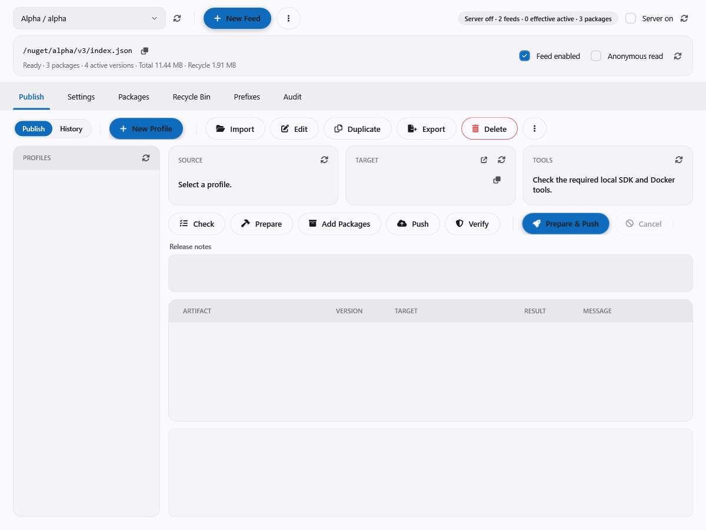
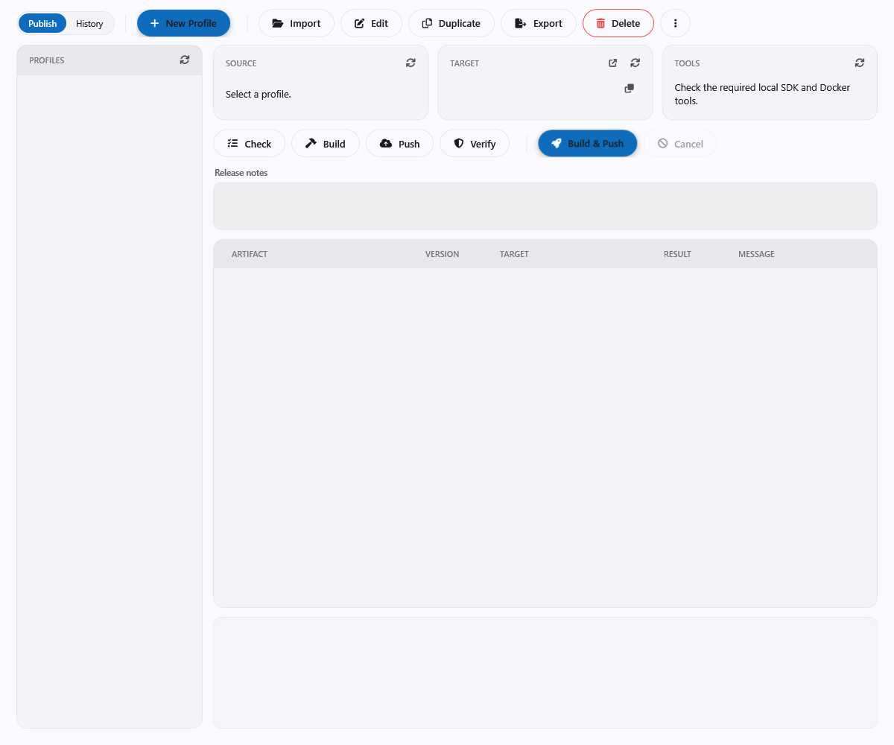

# Publish NuGet packages and containers from WPF

[Bahasa Indonesia](engine-publish.id.md)

**NuGet Manager** and **Container Manager** share a **Publish** tab and a **Publish history** view.
Publishing is a local developer operation: the signed-in GUI session only lists destinations, while a
separately configured robot or API key performs the push. Robot ownership does not inherit the owner's
rights.

- The built-in NuGet server requires **W** on the matching feed prefix.
- The built-in container registry requires **W** on the root.
- Manager and settings claims stay separate from publishing rights.



## Workflow

1. **Create a profile**, or use **Create profile from .slnx**. Select the workspace and sources, then review
   the evaluated package IDs and frameworks. Non-packable projects cannot be selected as packages; desktop
   projects are excluded as Linux container hosts.
2. **Set the build options, destination and host-scoped credentials.** Built-in destinations come from the
   active connection; after changing connections, select and check again. Missing feeds, prefixes, roots
   or containers must be created in their manager first.
3. **Check** validates tools, sources and target. **Prepare** (NuGet) or **Build** (container) produces
   artifacts without pushing. NuGet also accepts existing `.nupkg` files through the picker or drag and
   drop.
4. Select artifacts, enter release notes if required, review the confirmation, and **Push**.
   **Prepare & Push** / **Build & Push** combines both steps. Cancel stops only process trees the runner
   started. Review partial results before retrying; items that already succeeded are skipped on retry.
5. **Verify** checks the NuGet package identity and SHA-512, or the remote OCI manifest digest.
   Verification results are kept separate from push results. Remote tag discovery uses OCI, not a
   vendor API.



## Profiles and local files

| Item | Default location |
| --- | --- |
| Profiles | `Documents\Em\Publish\Profiles\NuGet` and `...\Profiles\Container` |
| Run logs | `Documents\Em\Publish\Logs` |
| Work folders | `LocalApplicationData\Em\Publish\Work` |
| Remembered secrets | `LocalApplicationData\Em\Publish\Secrets` |

Publisher settings can change the Profiles, Logs and Work folders; preferences are stored under the
application's registry key (so each application, for example Em System and EmPorium House, has its own
choice, while the default folders are shared). Profile files are written atomically; external edits require a reload or an
explicit overwrite. Import and duplicate create independent credential references. Deleting a profile
keeps its history, and history includes deleted profiles. Run logs are kept until deleted manually.

```json
{
  "formatVersion": 1,
  "id": "8b89b6538a83469d894951e13efad379",
  "name": "Engine packages",
  "kind": "NuGet",
  "description": "",
  "workspace": ".",
  "sensitiveDataStorage": "Separate",
  "nuGet": {
    "sources": [{ "path": "src/backend/Em.Api.slnx", "projects": [] }],
    "configuration": "Release",
    "versionOverride": "1.0.0",
    "msbuildProperties": [],
    "target": { "type": "Custom", "serviceIndex": "https://packages.example/v3/index.json" },
    "duplicateHandling": "Skip"
  },
  "credentials": [],
  "keepWorkspace": false,
  "requireReleaseNotes": true
}
```

One file per profile, format version 1, with a stable GUID ID. Relative source paths resolve from the
workspace. NuGet profiles support several project or solution sources.

### Container modes

Container profiles use one of five modes: **Dockerfile**, **LocalImage**, **Template**, **Compose** and
**Set**.

- The form edits build arguments, named contexts, BuildKit secret references, configuration, runtime,
  framework, publish profile, environment, ports and entrypoint. The generated Dockerfile and the file
  set can be previewed before building.
- **Compose** builds the selected services only and never runs `up`.
- **Template** can use a project `.pubxml`; `PublishDir` is redirected into the run workspace.
- **Set** builds Base before App, sharing identical publish inputs. Named file lists support IncludeOnly and
  Exclude complements, with Error (default) or Warning for missing entries. Existing Dockerfiles build
  against the staged output, optionally under a named subfolder (`.file-base`, `.file-module`). App can use
  the Base digest from the same run, the last successful Base log, or an explicit reference. Immutable Base
  references and release notes are recorded in history.
- Duplicate a profile for .NET or repository variants.

## Credentials

**Separate** is the default storage. **Remember** stores credentials encrypted with DPAPI CurrentUser under
LocalApplicationData; without Remember they last only for the application session. A failed decryption
makes the credential unavailable.

- Credentials are scoped to the effective host (including port) and are never sent to a different host.
- **Plaintext** stores secrets as ordinary JSON text: anyone who can read or copy that file can use them.
  Profile files on disk are never encrypted; only export bundles (below) are.
- Secret fields are masked.

### Export and import with secrets

**Export** asks whether to include sensitive data. The default is no: the file has paths made portable and
no secrets, and the passwords must be entered again after import. With **Include sensitive data** you pick:

- **Encrypted with a passphrase** (recommended): a bundle file, `.ctnconfig` for Container Manager profiles
  and `.nugetconfig` for NuGet Manager profiles. The content is AES-256-GCM with a key derived from the
  passphrase (PBKDF2-SHA256, 600,000 iterations); the passphrase is at least 8 characters, is never stored
  and cannot be recovered. The bundle does not depend on a Windows account, so it opens on any computer.
- **Plain text**: an ordinary `.json` file with the secrets in clear text. Anyone who can read the file can
  use them.

Secrets of a **Separate** profile are read from the session or from Remember storage; a credential with no
stored secret is exported empty and the screen says how many. **Import** accepts `.json` and bundle files
(it asks for the passphrase) and restores the secrets: inline for a Plaintext profile, and into Remember
storage (DPAPI for the importing account) for a Separate profile, so the profile can push right away.
Credentials always get new IDs, so an import never touches another profile's remembered secrets.

## Tools and runtime behavior

- Requires the .NET SDK 8 or later for metadata evaluation (the project's own SDK and `global.json` still
  apply), a Docker daemon for images, Compose v2 for Compose, and Buildx for platform builds.
- NuGet pushes run in-process through NuGet.Protocol, so API keys never appear in process arguments. A
  version that sits in the target recycle bin still fails and needs a manual restore or purge. Only
  `.nupkg` is supported.
- Docker runs with a temporary `DOCKER_CONFIG`, logs in through password stdin, and passes BuildKit secrets
  as environment variables. **Use my Docker login** is an explicit profile option; OCI verification and
  tag discovery may read that host's existing Docker config or credential helper without changing it or
  saving its secret.
- The container version tag is set on the Publish page strip only, not in the profile form. The profile's
  **Tagging** (chosen once at creation, then fixed) decides the strip: Standard = A.B.C + channel with an automatic
  build number, Manual = one box for a free tag. The floating tags follow the channel and are pushed after the
  version tag: a prerelease moves its channel tag, release moves `release`, `latest`, `A.B` and `A`, a manual tag
  moves none (doc/convention/container-naming.md). Compose sets a tag per service in the form.
- Work cleanup validates ownership and containment; user source and output folders are never removed.
  Prepared packages and shared publish output stay with their run so a later Push can use the snapshot.
- Logs contain masked output, stage exit codes, effective destinations, artifacts, separate verification
  results, non-secret settings and retry references. An unfinished run appears as **Interrupted**.

## Limitations

External registries that send bearer credentials to a separate authentication host need a separately
scoped integration; the publisher never sends registry credentials across host boundaries. Symbols,
encrypted profile files on disk, automatic log retention and remote or MAUI builds are not implemented.
