# Container registry: panduan pemakaian

[English](engine-registry-guide.md)

Panduan langkah demi langkah memakai container registry bawaan dari client WPF: **Container Manager** (tab
Containers, Settings, dan Publish) serta **User Manager → Robots**. Setiap opsi di layar tersebut dijelaskan
di samping screenshot yang diberi tanda.

Untuk pemasangan di server, action HTTP, dan pengujian dengan Docker, lihat [Container registry](engine-registry.md).
Rujukan terkait: [Publish](engine-publish.md), [Storage settings](engine-storage-settings.md),
[Robot identities](engine-robots.md), dan [penamaan image container](../convention/container-naming.md).

Screenshot hanya memakai data contoh: server `registry.example.com`, root `acme`, container `api`, dan robot
`acme-publisher`.

## Isi

- [Sebelum mulai](#sebelum-mulai)
- [Jalur cepat: image pertama](#jalur-cepat-image-pertama)
- [1. Tab Containers](#1-tab-containers)
- [2. Robot dan hak akses](#2-robot-dan-hak-akses)
- [3. Tab Settings](#3-tab-settings)
- [4. Tab Publish](#4-tab-publish)
- [Mengatasi masalah](#mengatasi-masalah)

## Sebelum mulai

| Kebutuhan | Alasan |
| --- | --- |
| Registry sudah dinyalakan di server API | Lihat [Container registry → Enabling](engine-registry.md#enabling). Kalau belum, tab Containers menampilkan "Container registry is not enabled on this server." |
| Claim `Container Manager Access` | Membuka Container Manager dan menampilkan daftar root serta container untuk publish |
| Claim `Container Registry Settings Manage` | Mengubah isi tab Settings (melihat status saja cukup dengan claim manager) |
| Claim `User Manager Access` | Membuat robot dan memberi hak aksesnya |
| HTTPS di server | Docker hanya menerima HTTP biasa untuk `localhost`. Layar memberi peringatan kalau koneksi aktif memakai HTTP biasa ke host lain |
| Docker di komputer yang mem-publish | Build dan push menjalankan Docker CLI lokal. Buildx hanya perlu kalau platform diisi; .NET SDK hanya untuk mode Template dan Set |

Semua claim ada di modul `Administrative Tools`; administrator otomatis memiliki semuanya.

## Jalur cepat: image pertama

1. Tab **Containers** → **New Root** (misalnya `acme`).
2. Pilih root tersebut → **New Container** (misalnya `api`). Push tidak pernah membuat nama baru, jadi container
   harus dibuat lebih dulu.
3. **User Manager → Robots** → **New robot**, lalu salin token dari dialog. Token hanya ditampilkan sekali.
4. Di **Manager access** robot itu, atur `Container / acme` menjadi **Write**.
5. **Container Manager → Publish** → **New Profile**: pilih mode, pilih tujuan `acme/api`, isi version tag dan
   kredensial robot.
6. **Check**, lalu **Build & Push**, lalu **Verify**.
7. Kembali ke **Containers**: container `acme/api` sekarang menampilkan tag baru.

Nama pull selalu `host/root/container`, tepat dua segmen setelah host:
`registry.example.com/acme/api:1.0.0-alpha.1`. Aturan tag mengikuti
[penamaan image container](../convention/container-naming.md).

## 1. Tab Containers

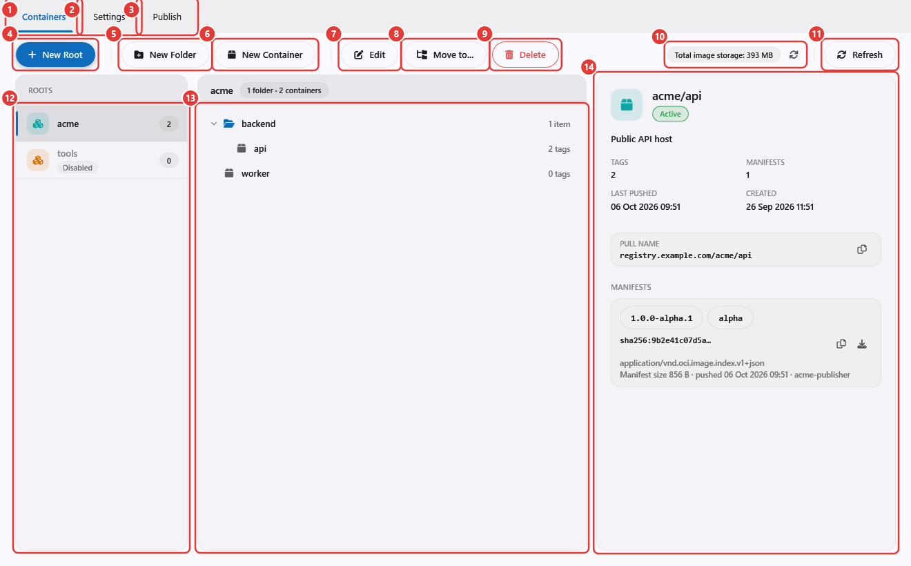

| # | Kontrol | Fungsi |
| --- | --- | --- |
| 1 | Tab **Containers** | Root, folder, dan container di registry |
| 2 | Tab **Settings** | Menyalakan atau mematikan registry dan memindahkan penyimpanannya; lihat [3. Tab Settings](#3-tab-settings) |
| 3 | Tab **Publish** | Build dan push image; lihat [4. Tab Publish](#4-tab-publish) |
| 4 | **New Root** | Membuat root: pemilik, satuan hak akses, dan bagian pertama setiap nama pull |
| 5 | **New Folder** | Membuat folder di root atau folder yang dipilih (sampai 8 tingkat). Folder hanya mengelompokkan container di layar ini dan tidak pernah muncul di nama pull |
| 6 | **New Container** | Membuat container di root atau folder yang dipilih. Container harus ada sebelum apa pun bisa di-push ke sana |
| 7 | **Edit** | Root terpilih: deskripsi dan saklar Active. Folder: ganti nama (F2). Container: deskripsi dan saklar Active |
| 8 | **Move to...** | Memindahkan folder atau container ke folder lain dalam root yang sama. Drag and drop di tree melakukan hal yang sama. Nama pull tidak berubah |
| 9 | **Delete** | Menghapus item terpilih (tombol Delete). Root atau folder harus kosong; container dihapus bersama manifest dan tag-nya. Yang dihapus hanya metadata; berkas layer tetap ada di disk |
| 10 | Chip penyimpanan dan tombol refresh-nya | Total ukuran layer dan manifest yang tersimpan, dibaca dari metadata registry. Tombol kecil hanya memuat ulang angka ini |
| 11 | **Refresh** | Memuat ulang root dan container (F5) |
| 12 | Daftar root | Semua root beserta jumlah container-nya. Root berstatus **Disabled** menolak semua push dan pull |
| 13 | Tree | Folder dan container di root terpilih, beserta jumlah item dan tag. Klik kanan membuka aksi yang sama dengan toolbar |
| 14 | Detail | Root, folder, atau container yang dipilih |

Nama memakai huruf kecil dan angka, dipisahkan `.`, `_`, atau `-` (root maksimal 64 karakter, container
maksimal 128). Nama root dan container tidak bisa diubah setelah dibuat; hanya folder yang bisa diganti nama.

### Root baru dan container baru

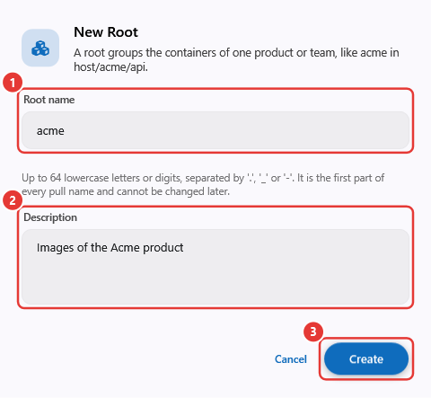

| # | Kontrol | Fungsi |
| --- | --- | --- |
| 1 | **Root name** | Segmen pertama nama pull, misalnya `acme` pada `host/acme/api` |
| 2 | **Description** | Catatan opsional untuk operator lain |
| 3 | **Create** | Membuat root dalam keadaan aktif. Pakai **Edit** nanti untuk menonaktifkannya |

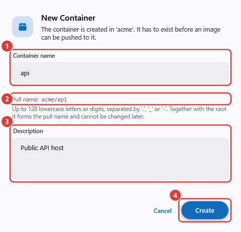

| # | Kontrol | Fungsi |
| --- | --- | --- |
| 1 | **Container name** | Segmen kedua nama pull |
| 2 | Pratinjau **Pull name** | `root/container` yang dihasilkan nama ini |
| 3 | **Description** | Opsional |
| 4 | **Create** | Membuat container di root (dan folder) yang dipilih sebelum dialog dibuka |

### Detail container

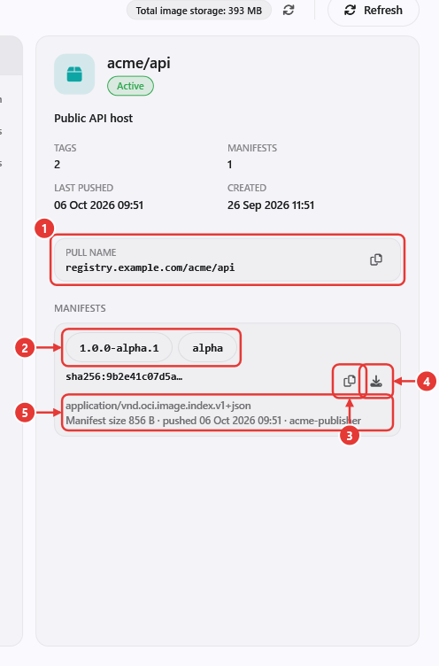

| # | Kontrol | Fungsi |
| --- | --- | --- |
| 1 | **Pull name** dan tombol salin | `host/root/container` untuk koneksi aktif. Tombol salin menyalinnya |
| 2 | Chip tag | Satu chip per tag pada manifest. Klik menyalin `docker pull` untuk tag itu; klik kanan menawarkan **Copy docker pull** dan **Copy docker tag + push** |
| 3 | Salin digest | Menyalin digest manifest (`sha256:...`) |
| 4 | Salin docker pull by digest | Menyalin `docker pull host/root/container@sha256:...`, yang selalu mengambil build yang persis sama |
| 5 | Media type dan rincian | Jenis manifest, ukuran manifest, waktu push, dan robot yang mem-push |

Detail juga menampilkan **Tags**, **Manifests**, **Last pushed**, dan **Created**. Untuk root, detail
menampilkan jumlah folder dan container serta **Pull prefix**-nya.

## 2. Robot dan hak akses

Robot adalah akun yang dipakai `docker login`: namanya menjadi username dan token-nya menjadi password. Robot
dikelola di **User Manager → Robots** karena manager lain (misalnya server NuGet) juga memakainya.

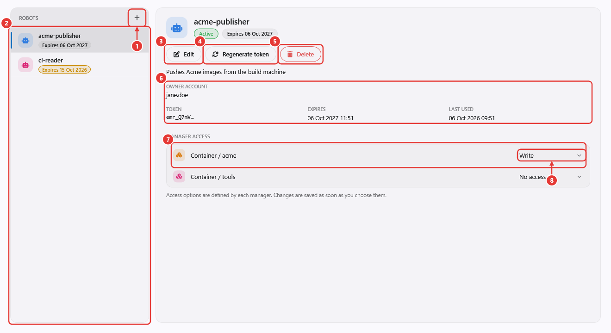

| # | Kontrol | Fungsi |
| --- | --- | --- |
| 1 | **New robot** (+) | Membuka dialog New Robot |
| 2 | Daftar robot | Semua robot dengan chip masa berlaku: abu-abu bila masih berlaku, kuning bila habis dalam 14 hari, **Expired** setelah lewat tanggalnya |
| 3 | **Edit** | Mengubah deskripsi, saklar Active, dan masa berlaku token. Robot nonaktif tidak bisa login |
| 4 | **Regenerate token** | Membuat token baru dan menampilkannya sekali; token lama langsung tidak berlaku |
| 5 | **Delete** | Menghapus robot beserta semua hak aksesnya (tombol Delete) |
| 6 | Pemilik, token, masa berlaku, pemakaian terakhir | Akun pemilik (hanya informasi, tidak memberi hak apa pun), beberapa karakter awal token, tanggal kedaluwarsa, dan login terakhir yang berhasil |
| 7 | Baris hak akses | Satu baris per resource manager. Untuk registry, setiap root menjadi satu baris bernama `Container / <root>` |
| 8 | Pilihan hak | **No access**, **Read** (pull), atau **Write** (push dan pull). Pilihan langsung tersimpan begitu diubah |

Robot tanpa hak di sebuah root bahkan tidak bisa melihatnya (`NAME_UNKNOWN`). Satu robot boleh punya Write di
satu root dan Read di root lain, sehingga `FROM host/base/runtime` di Dockerfile dan push ke `host/acme/api`
berjalan dengan satu login.

### Robot baru

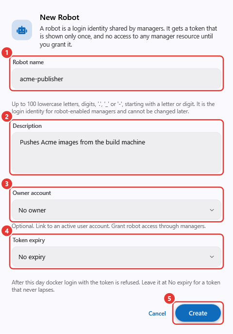

| # | Kontrol | Fungsi |
| --- | --- | --- |
| 1 | **Robot name** | Username `docker login`. Maksimal 100 karakter huruf kecil, angka, `.`, `_`, atau `-`, diawali huruf atau angka. Tidak bisa diubah kemudian |
| 2 | **Description** | Opsional, misalnya di mana robot ini dipakai |
| 3 | **Owner account** | Tautan opsional ke akun user aktif, dengan kotak pencarian. Hanya informasi: robot tidak pernah mewarisi hak pemiliknya |
| 4 | **Token expiry** | **No expiry**, **30**, **90**, atau **365 days from now**, atau **Choose a date...** (hari terakhir token boleh dipakai). Setelah hari itu `docker login` ditolak |
| 5 | **Create** | Membuat robot tanpa hak akses apa pun lalu menampilkan token-nya |

### Token

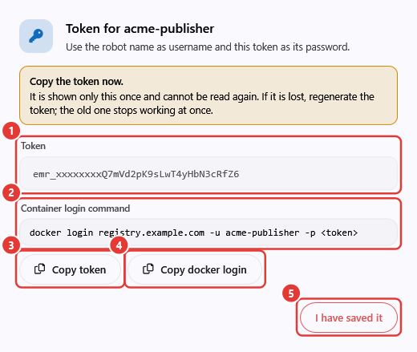

| # | Kontrol | Fungsi |
| --- | --- | --- |
| 1 | **Token** | Password untuk `docker login`. Server hanya menyimpan hash-nya |
| 2 | **Container login command** | Baris `docker login` siap pakai untuk server dan robot ini |
| 3 | **Copy token** | Menyalin token, misalnya untuk kredensial profil publish |
| 4 | **Copy docker login** | Menyalin perintah login |
| 5 | **I have saved it** | Menutup dialog. Token tidak bisa ditampilkan lagi; kalau hilang, pakai **Regenerate token** |

## 3. Tab Settings

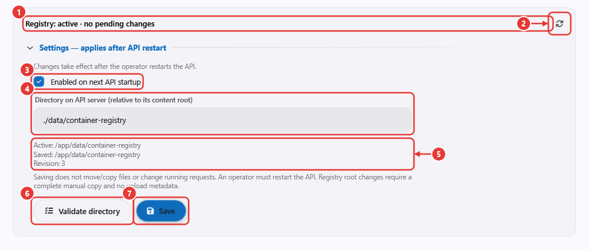

| # | Kontrol | Fungsi |
| --- | --- | --- |
| 1 | Baris status | `active` atau `disabled`, apakah ada perubahan tersimpan yang menunggu restart API, dan `static host configuration` bila host menetapkan path di kode (Save tidak tersedia) |
| 2 | Refresh | Memuat ulang status dan pengaturan. Bertanya dulu kalau ada draf yang belum disimpan |
| 3 | **Enabled on next API startup** | Menyalakan atau mematikan registry mulai start berikutnya |
| 4 | **Directory on API server** | Tempat layer dan upload disimpan, di file system server, relatif terhadap content root-nya. Bukan folder di komputer Anda |
| 5 | Active, saved, revision | Direktori yang dipakai sekarang, direktori tersimpan untuk start berikutnya, dan revisi untuk mendeteksi penyimpanan bersamaan |
| 6 | **Validate directory** | Memeriksa direktori draf di server dengan berkas uji. Untuk root registry baru, semua layer tersimpan ikut diperiksa |
| 7 | **Save** | Menyimpan draf. Baru berlaku setelah operator me-restart API |

Save tidak pernah memindahkan, menyalin, atau menghapus berkas. Untuk memindahkan registry, salin seluruh
direktori secara manual, pastikan tidak ada upload yang berjalan, lalu validate, save, dan restart. Server
memeriksa ulang semua layer saat start. Rinciannya: [Storage settings](engine-storage-settings.md).

## 4. Tab Publish

Publish berjalan di komputer Anda dengan Docker CLI lokal. Sesi yang sedang login hanya menampilkan daftar
tujuan; push sendiri login memakai token robot yang tersimpan di kredensial profil. Profil, log, dan folder
kerja adalah berkas lokal.

### Halaman dan profil

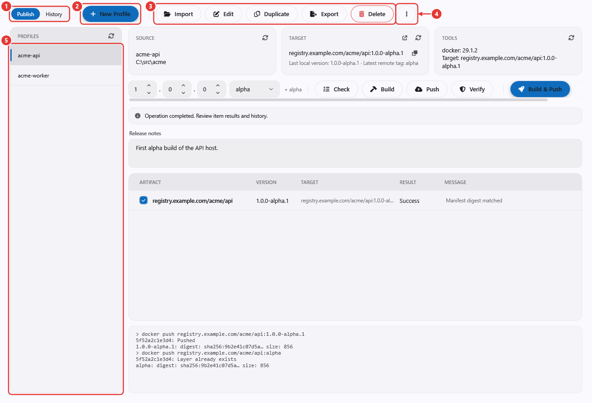

| # | Kontrol | Fungsi |
| --- | --- | --- |
| 1 | **Publish / History** | Berpindah antara halaman kerja dan riwayat run |
| 2 | **New Profile** | Membuka form profil kosong, dengan workspace diisi folder Documents |
| 3 | Alat profil | **Import** berkas profil `.json`; **Edit** profil terpilih; **Duplicate** (ID dan referensi kredensial baru); **Export** (data sensitif tidak ikut kecuali Anda memilihnya; secret yang disimpan terpisah tidak pernah diekspor); **Delete** berkas profil (riwayatnya tetap ada) |
| 4 | More (⋮) | **Create profile from .slnx** (membaca solution, memilih project host, dan memulai profil Template), **Refresh profiles**, **Open profiles folder**, **Publisher settings** |
| 5 | Profiles | Profil container di komputer ini. Memilih satu profil memuatnya ke area kerja |

### Area kerja

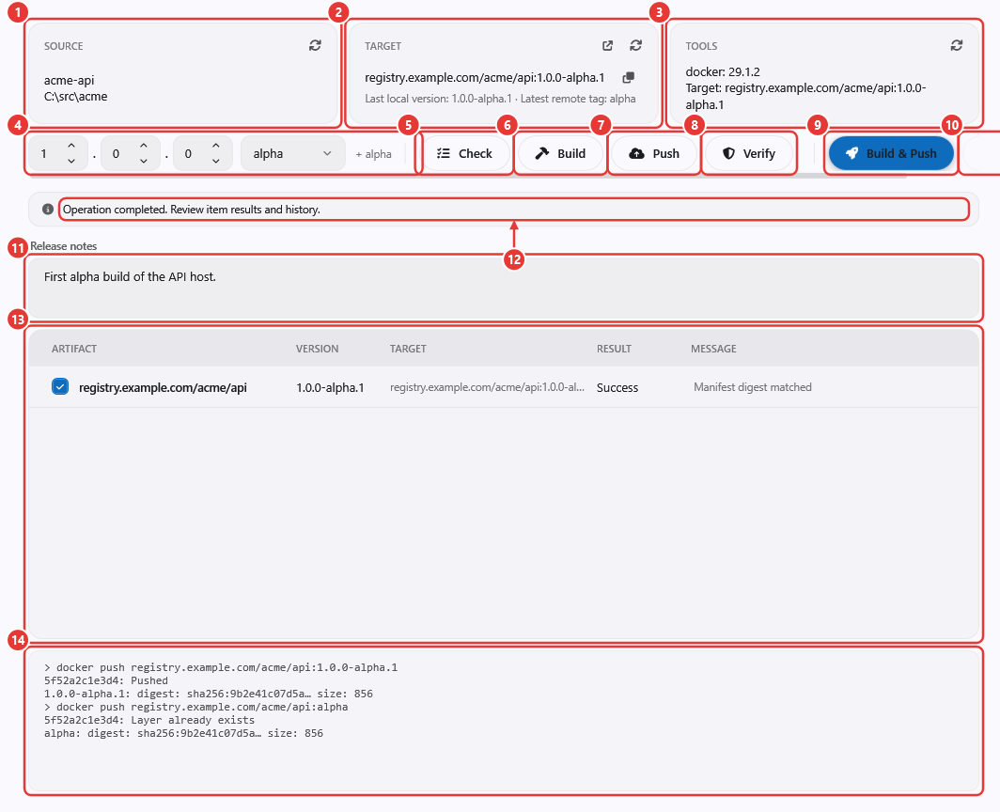

| # | Kontrol | Fungsi |
| --- | --- | --- |
| 1 | Kartu **Source** | Nama profil dan workspace. Refresh-nya menampilkan project di balik profil Template |
| 2 | Kartu **Target** | Target lengkap `host/root/container:tag`. Refresh mencocokkannya ke server dan menampilkan versi terakhir yang di-push dari komputer ini serta tag terbaru di registry. Tombol lain menyalin target dan membuka tab Containers |
| 3 | Kartu **Tools** | Versi alat yang dibutuhkan profil (Docker, dan .NET SDK untuk Template dan Set) |
| 4 | Version tag | Satu-satunya tempat tag image ditentukan (lihat [Version tag](#version-tag) di bawah). Dengan Tagging Standard: **A.B.C** dan channel; teks redup di sebelahnya menampilkan tag mengambang yang ikut dipindah build ini, misalnya `+ alpha`. Dengan Tagging Manual: satu kotak untuk seluruh tag |
| 5 | **Check** | Memvalidasi profil, workspace, dan alat, serta memastikan root dan container ada dan aktif. Juga memastikan ada kredensial untuk host registry. Tidak melakukan login |
| 6 | **Build** | Membangun image secara lokal, tanpa push. Artifact muncul di tabel |
| 7 | **Push** | Setelah konfirmasi, login dengan robot, push version tag, lalu tag mengambang milik channel-nya. Butuh Build dari sesi yang sama; kalau pengaturan source atau build berubah sejak itu, build ulang |
| 8 | **Verify** | Membaca manifest version tag dari registry dan membandingkan digest-nya dengan hasil push |
| 9 | **Build & Push** | Check, Build, dan Push dalam satu run dengan satu konfirmasi |
| 10 | **Cancel** | Menghentikan operasi yang berjalan. Hanya proses yang dimulai publisher yang dihentikan. Periksa hasil parsial sebelum mencoba lagi |
| 11 | **Release notes** | Disimpan bersama run. Wajib kalau profil mengaktifkan **Require Release Notes** |
| 12 | Baris pesan | Keadaan operasi terakhir atau error-nya. "Operation completed" hanya berarti operasi selesai tanpa error; baca kolom **Result** |
| 13 | Artifacts | Satu baris per image: checkbox memilihnya untuk Push dan Verify; **Version**, **Target**, **Result** (`NotRun`, `Running`, `Success`, `Failed`, `Cancelled`), dan **Message** (error dan hasil verifikasi) |
| 14 | Log langsung | Output perintah Docker. Baris `<tag>: digest: sha256:... size: ...` berarti tag itu sudah ter-push. `Layer already exists` pada tag mengambang itu normal, karena version tag sudah mengunggah layer-nya |

Build, Push, dan Verify bekerja pada artifact yang dibangun di sesi aplikasi saat ini. Setelah aplikasi dibuka
ulang, jalankan **Build** (atau **Build & Push**) lagi. Item yang sudah berhasil dilewati saat push diulang.

### Version tag

Tag diisi di halaman Publish (kontrol 4), bukan di form profil. Cara mengisinya mengikuti **Tagging** profil, yang
dipilih sekali saat profil dibuat (tab Target, field 5) dan tidak bisa diubah sesudahnya: memindahkan satu image antara
tag versi dan tag bebas akan mencampur keduanya di repository-nya. Untuk jenis lain, buat profil baru. **Standard**
mengikuti [container-naming](../convention/container-naming.md) dengan spin edit dan channel; **Manual** menampilkan
satu kotak untuk tag bebas. Nilainya disimpan ke profil, jadi tetap ada saat profil dipilih lagi. Strip ini tampil untuk mode Dockerfile, LocalImage, dan Template; Compose mengatur tag per service di form
profil, dan Set memakai tag dari profil masing-masing step.

| Channel | Version tag | Tag mengambang yang dipindah setelahnya |
| --- | --- | --- |
| **prealpha**, **alpha**, **beta**, **rc** | `A.B.C-channel.N`. N tidak diketik: satu di atas N tertinggi yang sudah ada di registry dan riwayat komputer ini untuk A.B.C dan channel itu | Hanya tag channel, misalnya `alpha` |
| **release** | `A.B.C`. Ditolak bila registry sudah memilikinya; version tag tidak pernah ditimpa | `release`, `latest`, `A.B`, dan `A`. Konfirmasi push memperingatkan bahwa `latest` ikut pindah |
| Tagging Manual | Teks di kotak tunggal, misalnya `dev` atau `hotfix-login` | Tidak ada |

Tag manual harus tag Docker yang valid dan ditolak bila berbentuk version tag (`1.0.0`, `0.2.0-beta.1`: pakai profil Standard)
atau tag mengambang (`latest`, `release`, nama channel, `1` atau `1.2`). Tag manual boleh di-push ulang menimpa dirinya
sendiri. Extra tag yang diketik di profil lama tidak dipakai lagi dan hilang saat profil disimpan berikutnya. Profil
lama yang menyimpan tag bebas dianggap Standard; Build berhenti dengan pesan sampai versi dipilih di strip, atau buat
ulang sebagai profil Manual.

### Form profil

Dibuka lewat **New Profile** atau **Edit**. Form punya lima tab; **Save** menyimpan profil, **Save As**
menyimpan salinan dengan ID baru, dan **Cancel** membuang perubahan. Error tampil di atas tombol.

#### Source

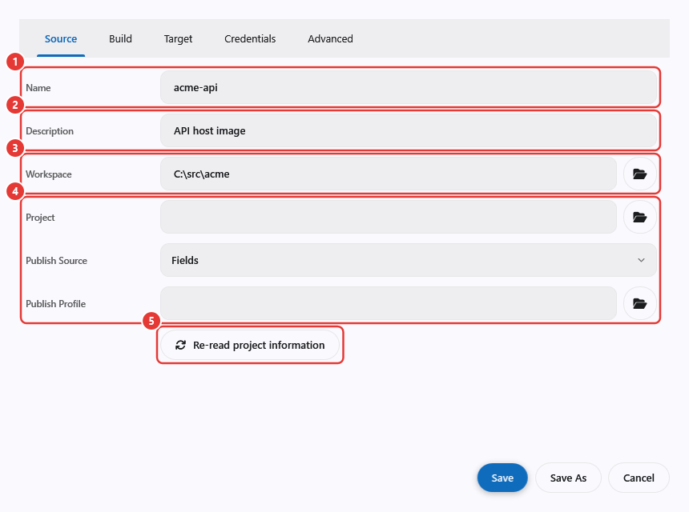

| # | Field | Arti |
| --- | --- | --- |
| 1 | **Name** | Tampil di daftar profil dan riwayat |
| 2 | **Description** | Opsional |
| 3 | **Workspace** dan tombol folder | Folder dasar. Semua path relatif di profil (context, Dockerfile, project) dihitung dari sini |
| 4 | **Project**, **Publish Source**, **Publish Profile** | Hanya untuk mode Template: project host yang di-`dotnet publish`, dan apakah pengaturannya diambil dari field form (**Fields**) atau dari publish profile `.pubxml` (**PublishProfile**) |
| 5 | **Re-read project information** | Membaca project (atau solution) dan memilih project host container |

#### Build

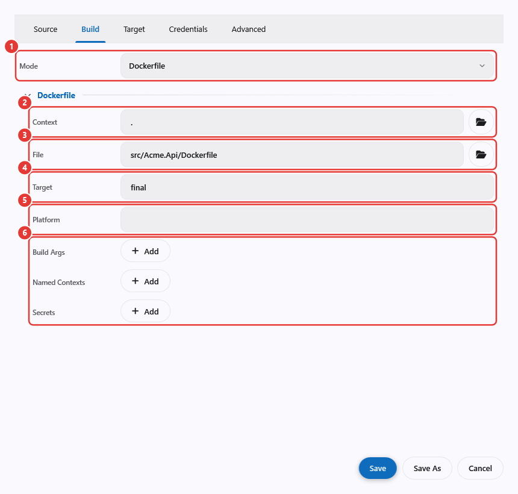

| # | Field | Arti |
| --- | --- | --- |
| 1 | **Mode** | Cara image dihasilkan (lihat tabel di bawah) |
| 2 | **Context** | Build context Docker, relatif terhadap workspace (`.` = workspace) |
| 3 | **File** | Dockerfile, relatif terhadap workspace |
| 4 | **Target** | Stage Dockerfile yang di-build (`--target`). Kosong berarti stage terakhir |
| 5 | **Platform** | Misalnya `linux/amd64` (`--platform`). Kosongkan untuk build sesuai engine Docker lokal; kalau diisi, Buildx wajib ada |
| 6 | **Build Args**, **Named Contexts**, **Secrets** | `--build-arg KEY=value`, `--build-context name=path`, dan secret BuildKit yang nilainya diambil dari kredensial profil (tidak pernah ditulis ke Dockerfile atau log) |

Seksi di bawah **Mode** hanya menampilkan pengaturan mode yang dipilih dan langsung berganti saat mode diubah;
pengaturan mode lain tetap tersimpan di profil. Tombol folder di sebelah path membuka pemilih berkas atau folder.

| Mode | Dipakai bila |
| --- | --- |
| **Dockerfile** | Repository sudah punya Dockerfile. Field 2 sampai 6 berlaku |
| **LocalImage** | Image sudah di-build secara lokal; publisher hanya memberi tag dan mem-push. **Select local image** menampilkan image di Docker lokal |
| **Template** | Project .NET tanpa Dockerfile sendiri. Publisher menjalankan `dotnet publish` (runtime, framework, self-contained, atau `.pubxml`), menyalin output yang dipilih **File Set** ke Dockerfile yang dibuatkan (base image, working directory, environment, port, zona waktu, entrypoint, baris `RUN` tambahan), atau memakai Dockerfile yang sudah ada terhadap output itu. **Preview generated Dockerfile** dan **Preview file set from folder** menampilkan hasilnya lebih dulu |
| **Compose** | `compose.yml` dengan service ber-`build:`. **Read Compose build services** menampilkan daftarnya; setiap service yang dipilih mendapat repository dan version tag sendiri, diatur di form ini (strip versi tidak dipakai). Hanya `build` yang dijalankan, tidak pernah `up` |
| **Set** | Beberapa profil berurutan, misalnya image Base lalu image App di atasnya. Setiap step memilih Build dan Push; named file list membagi satu output publish ke beberapa image |

#### Target

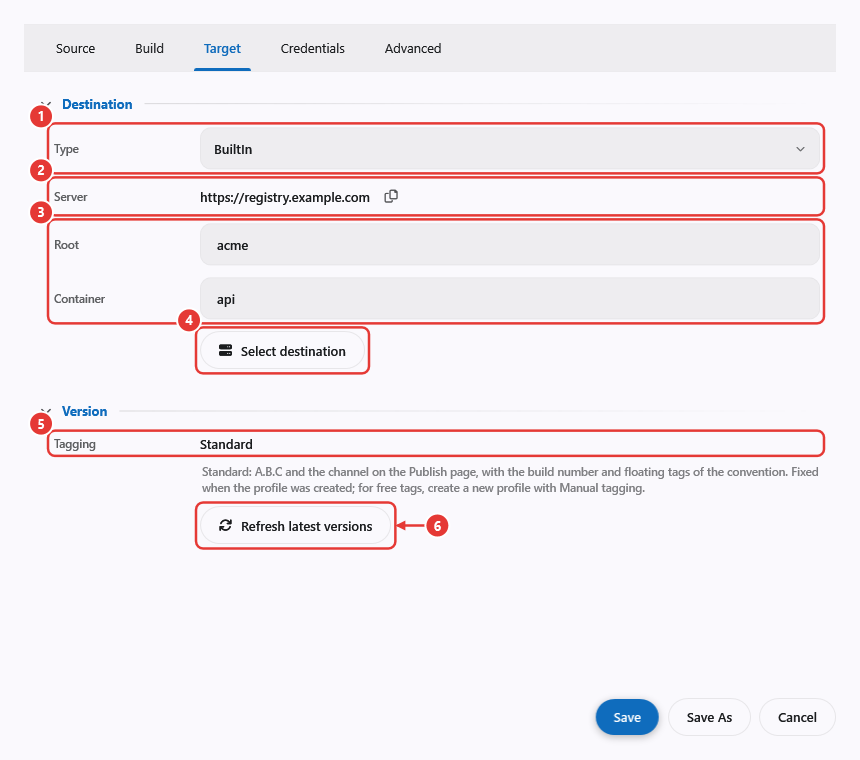

| # | Field | Arti |
| --- | --- | --- |
| 1 | **Type** | **BuiltIn**: registry di server yang sedang terhubung. **Custom**: registry lain (misalnya GHCR). Isi seksi lainnya berganti mengikuti pilihan ini |
| 2 | **Server** | Hanya BuiltIn. Koneksi aktif, dengan tombol salin; tidak diketik. Tempelkan ke **Scope Host** kredensial. Bila aplikasi belum terhubung, muncul catatan untuk menghubungkan dulu atau beralih ke Custom |
| 3 | **Root**, **Container** | Hanya BuiltIn. Tujuan di server itu. Diisi oleh tombol 4, atau diketik |
| 4 | **Select destination** | Hanya BuiltIn, aktif selama terhubung. Menampilkan dua daftar di bawah tombol: pilih root, lalu container. Field 3 ikut diperbarui dan pesan `Built-in target: root/container` menandakan pilihan sudah tersimpan |
| 5 | **Tagging** | **Standard** atau **Manual**, lihat [Version tag](#version-tag). Hanya bisa dipilih di **New Profile**; profil yang sudah ada menampilkannya sebagai teks |
| 6 | **Refresh latest versions** | Menampilkan versi terakhir yang di-push dari komputer ini dan tag terbaru di registry |

Dengan **Custom**, seksi ini menampilkan **Host** (host registry beserta port-nya, tanpa `http://`, misalnya `ghcr.io`
atau `registry.example.com:5000`) dan **Repository** (misalnya `acme/api`) menggantikan field 2 sampai 4. Tambahkan
kredensial push untuk host itu di Credentials, dan centang **Allow Http** di sana untuk registry HTTP polos. Tujuan
yang dipilih di server lain memunculkan catatan agar dipilih ulang. Version tag tidak diatur di sini; lihat
[Version tag](#version-tag).

Masalah yang diketahui pada tombol 4 (lihat [publish-ui-review](../ideas/publish-ui-review.md)):
- Daftarnya bisa menampilkan `Em.Api.Core.Models.CtnRootInfo`, bukan nama root atau container. Jadi, andalkan
  pesan konfirmasi `Built-in target: root/container`.
- Root yang belum punya container menghasilkan daftar kedua yang kosong tanpa pesan apa pun. Buat containernya
  lebih dulu.

#### Credentials

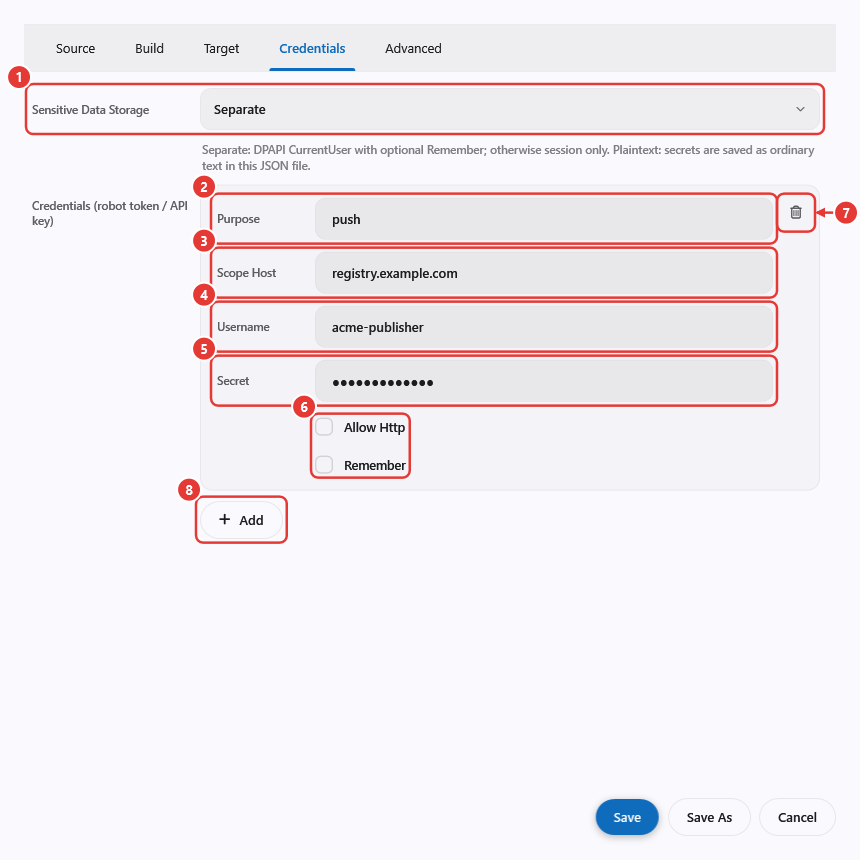

| # | Field | Arti |
| --- | --- | --- |
| 1 | **Sensitive Data Storage** | **Separate** (bawaan): secret disimpan di luar berkas profil, terenkripsi untuk akun Windows Anda. **Plaintext**: secret ditulis ke JSON profil sebagai teks biasa; siapa pun yang bisa membaca berkasnya bisa memakainya |
| 2 | **Purpose** | Biarkan `push` untuk login registry |
| 3 | **Scope Host** | Host registry beserta port-nya bila ada, misalnya `registry.example.com`. Awalan `https://` dan huruf besar-kecil diabaikan. Kredensial tidak pernah dikirim ke host lain, jadi host yang tidak cocok memunculkan "No credential for host '...'". Host registry pada tujuan bawaan diambil dari koneksi yang aktif, jadi periksa koneksi itu juga. |
| 4 | **Username** | Nama robot |
| 5 | **Secret** | Token robot |
| 6 | **Allow Http**, **Remember** | **Allow Http**: lihat di bawah. **Remember** menyimpan secret untuk sesi berikutnya (Windows DPAPI, user saat ini); tanpa ini secret hanya bertahan sampai aplikasi ditutup |
| 7 | Hapus (ikon tong sampah) | Menghapus kredensial ini |
| 8 | **Add** | Menambah kredensial lain, misalnya untuk registry kedua yang dipakai `FROM` |

**Allow Http** membuat permintaan registry milik publisher
sendiri (Verify dan penemuan tag) memakai `http://` polos untuk host itu. Ia tidak mengubah cara Docker melakukan
push: daemon Docker yang memilih https atau http, sehingga registry HTTP polos juga harus terdaftar di
`insecure-registries` Docker. **Check** membaca pengaturan registry Docker dan menampilkan baris `Warning:` bila
host akan ditolak, atau bila host-nya `localhost` pada Docker Desktop yang engine-nya berjalan di VM.

Untuk mendaftarkan host tanpa membuka pengaturan Docker, pakai **More (⋮) > Add registry to Docker insecure-registries**.
Setelah Anda mengonfirmasi, host registry profil ditambahkan ke `insecure-registries` di
`%USERPROFILE%\.docker\daemon.json`, pengaturan lain tetap utuh, dan cadangan disimpan di sebelah berkas itu lebih dulu.
Restart Docker Desktop (ikon tray > Restart) agar berlaku, lalu jalankan Check lagi. Tidak ada yang dihapus otomatis;
hapus entri itu secara manual untuk membatalkannya.

#### Advanced

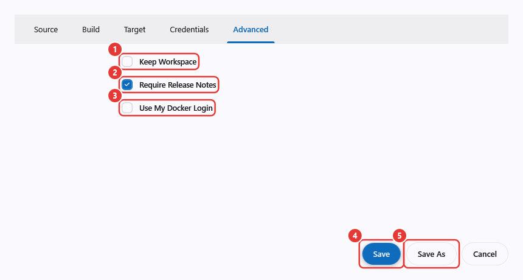

| # | Field | Arti |
| --- | --- | --- |
| 1 | **Keep Workspace** | Menyimpan folder kerja run setelah selesai, untuk diperiksa |
| 2 | **Require Release Notes** | Push dan Build & Push menolak berjalan bila release notes kosong |
| 3 | **Use My Docker Login** | Memakai login yang sudah tersimpan di Docker Anda (`docker login` atau credential helper) sebagai pengganti kredensial profil |
| 4 | **Save** | Menyimpan profil |
| 5 | **Save As** | Menyimpan salinan dengan ID baru |

### Riwayat

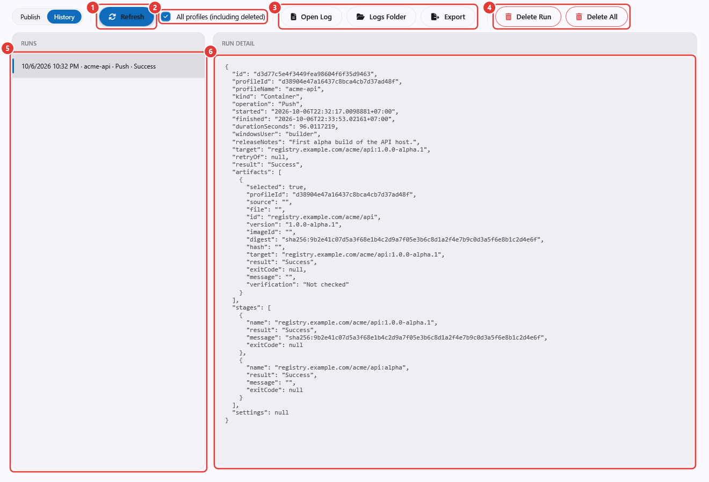

| # | Kontrol | Fungsi |
| --- | --- | --- |
| 1 | **Refresh** | Memuat ulang daftar run |
| 2 | **All profiles (including deleted)** | Menampilkan run semua profil; bila tidak dicentang hanya profil terpilih |
| 3 | **Open Log**, **Logs Folder**, **Export** | Membuka `output.log` run, membuka folder log, atau menyimpan run sebagai `.zip` |
| 4 | **Delete Run**, **Delete All** | Menghapus run terpilih, atau semua run profilnya, secara permanen |
| 5 | Runs | Waktu mulai, profil, operasi, dan hasil. Run yang tidak pernah selesai tampil sebagai **Interrupted** |
| 6 | Run detail | Semua yang tercatat: target, release notes, artifact beserta digest, tahapan, dan pengaturan yang tidak rahasia |

### Publisher settings

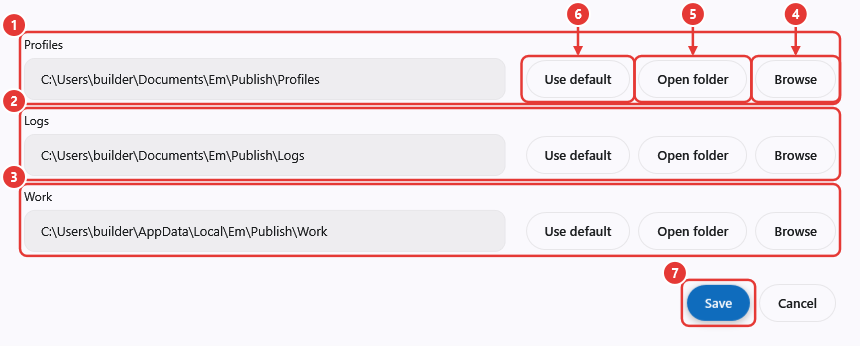

| # | Kontrol | Fungsi |
| --- | --- | --- |
| 1 | **Profiles** | Folder berkas profil (bawaan `Documents\Em\Publish\Profiles`) |
| 2 | **Logs** | Folder log run (bawaan `Documents\Em\Publish\Logs`). Log disimpan sampai dihapus |
| 3 | **Work** | Folder build sementara (bawaan `AppData\Local\Em\Publish\Work`) |
| 4 | **Browse** | Memilih folder |
| 5 | **Open folder** | Membukanya di Explorer |
| 6 | **Use default** | Mengembalikan path bawaan |
| 7 | **Save** | Menyimpan. Ketiga folder harus terpisah (tidak ada yang berada di dalam yang lain) |

## Mengatasi masalah

| Gejala | Penyebab dan solusi |
| --- | --- |
| `NAME_UNKNOWN` | Container belum dibuat, robot tidak punya hak di root itu, atau root/container dinonaktifkan |
| `DENIED` saat push | Robot hanya punya Read di root itu; ubah menjadi Write |
| `NAME_INVALID` | Ada huruf besar, atau lebih dari dua segmen setelah host |
| `unauthorized` saat login | Token salah atau sudah di-regenerate, token kedaluwarsa, atau robot dinonaktifkan |
| Docker menolak `http://` | Server harus diakses lewat HTTPS; HTTP biasa hanya berlaku untuk `localhost` atau host yang terdaftar di `insecure-registries` |
| `Get "https://localhost:5132/v2/": ... Client.Timeout exceeded` saat Build & Push | Daemon Docker Desktop berjalan di dalam VM, sehingga `localhost`-nya bukan Windows. Pakai server yang bisa dijangkau daemon (server tes, atau `Em.Api` yang di-bind ke alamat non-loopback) dan tambahkan `host:port` itu ke `insecure-registries` Docker, lalu pilih koneksi tersebut |
| "No credential for host '...'" / "The credential for host '...' has no secret in this session" | Tidak ada kredensial yang **Scope Host**-nya sama dengan host registry (pesannya menyebut host yang memang dimiliki profil), atau secret-nya tidak disimpan. Host registry pada tujuan bawaan adalah koneksi yang aktif, sehingga profil yang disimpan untuk satu server gagal saat Check selama server lain yang dipilih |
| "Built-in connection changed. Select this server and Check again." | Koneksi aktif berbeda dengan server di profil; pilih ulang tujuannya |
| "Root missing. Open Containers, then refresh." / "Container missing..." | Buat di tab Containers, atau pilih ulang |
| "Source/build settings changed; Prepare ulang." | Profil berubah setelah Build; jalankan Build lagi |
| "Version tag is required and must be a valid Docker tag." | Isi **Version Tag**: huruf, angka, `_`, `.`, `-`, maksimal 128 karakter |
| "Release notes are required." | Isi **Release notes** atau matikan **Require Release Notes** |
| "Registry storage disabled." | Registry mati di server; lihat [3. Tab Settings](#3-tab-settings) |

## Catatan maintainer

Screenshot dirender offline dari kontrol aslinya dengan data contoh oleh harness yang disimpan di luar
repository. Jalankan dari root repo:
`dotnet run --project ..\.artefacts\em-system\scripts\registry-guide-render -- doc/engine/images/registry-guide`.
Harness menulis PNG beranotasi ke folder tersebut. Path publisher disimpan di memori dengan folder sementara,
jadi profil, log, dan registry key yang asli tidak pernah tersentuh.
