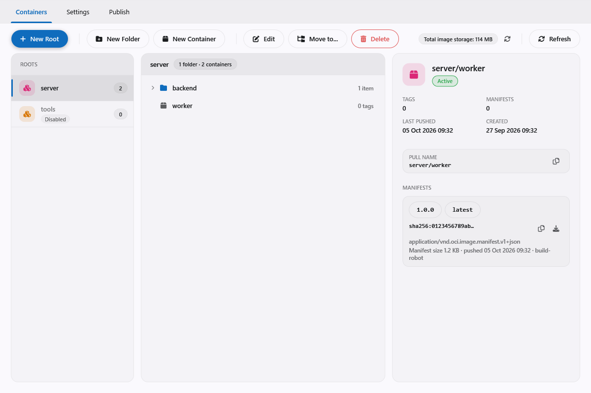
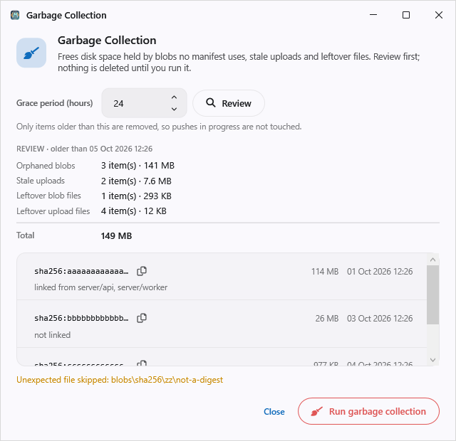
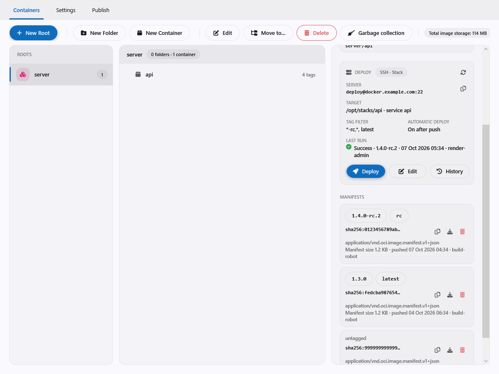
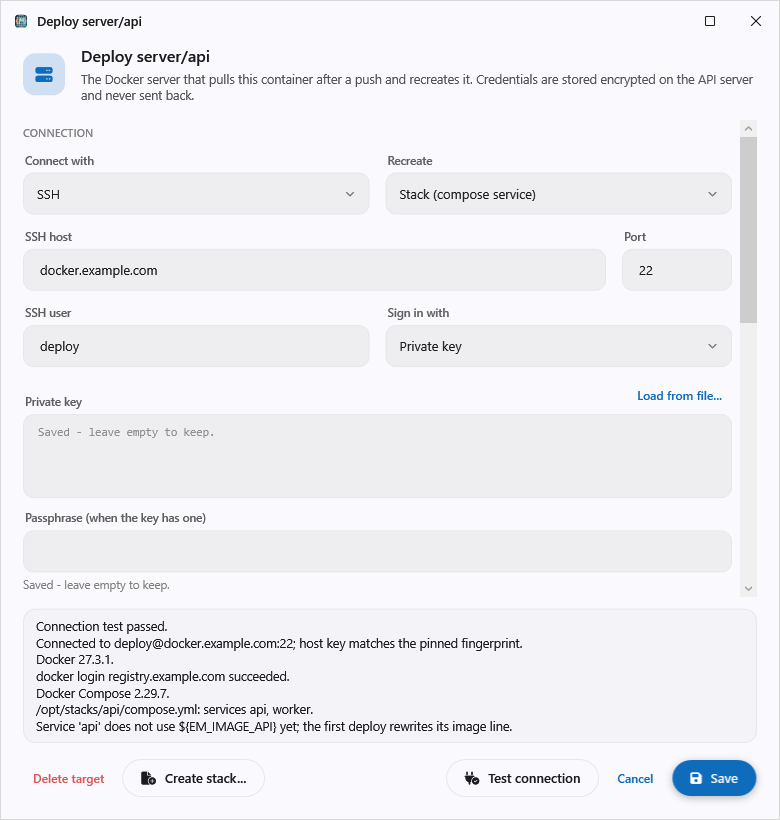

# Container registry

The API host includes an OCI container registry (`/v2`) built into `Em.Api.Core` (`Api/Registry/`), next
to the CDN and the approval engine. This page covers enabling it, creating roots, containers and robots,
the WPF **Container Manager**, and testing. For a step-by-step walkthrough of every screen and option, see the
[user guide](engine-registry-guide.md) ([Bahasa Indonesia](engine-registry-guide.id.md)).



## Enabling

1. Run `doc/sqlscript/mssql/tables/030-registry.sql` on the core database after `tables/010-core.sql`
   (which creates `ta_Robot`). The script is safe to run again. Older databases must first run the robot
   migrations described in [Robots](engine-robots.md).
2. In the host `Program.cs`, either:
   - call `builder.AddManagedStorageSettings()` (recommended; used by `Em.Api`). The registry is enabled by
     default at `./data/container-registry` and can be turned off or moved from the Container Manager
     Settings card. See [Storage settings](engine-storage-settings.md). Or:
   - call `builder.AddContainerRegistry(localStorePath: "./data/container-registry")` for a fixed path.

   Relative paths resolve from the application content root. Layer content is stored in `blobs/sha256/..`
   and temporary uploads in `uploads/`. A second registration is rejected. Without a registry, `/v2` and
   the management actions return 404.
3. On startup the server checks every `ta_Ctn*` table. If any is missing, startup fails with a message
   naming the script. Managed storage settings require the registry tables even when the registry is
   disabled.

## Model

- Pull names are **`host/root/name`, exactly two segments** (`localhost:5132/acme/api:v1`). Three or more
  segments return `NAME_INVALID`. Lowercase letters, digits and the separators `.`, `_`, `-` are allowed
  (root up to 64 characters, name up to 128).
- A **root** is the owner and the unit of access. **Folders** only group containers inside a root (up to 8
  levels) and do not appear in the pull name. A **container** (`root/name`) must be created through the
  management actions first; pushing to an unregistered name returns `NAME_UNKNOWN`. A push never creates a
  name.
- A **robot** is a `docker login` account (name + token). Access is granted per root: `R` (pull) or `W`
  (push, which includes pull). A robot without a grant on a root cannot see it (`NAME_UNKNOWN`). One robot
  can have `W` on `acme` and `R` on `server`, so `FROM host/server/base` plus a push to `host/acme/api`
  works with one login, including mounting base layers from `server`.
- Managing containers requires the `Container Manager Access` claim; robot identities, tokens and grants
  require `User Manager Access`. Both claims belong to module `Administrative Tools`. Robots can be shared
  by several managers; see [Robots](engine-robots.md).
- Tokens have 256 bits of entropy and are shown **once**; only their SHA-256 hash is stored. One robot has
  one token. `PostGetMeta_RobotRegenerate` issues a new token and the old one stops working immediately.
- All times are UTC.

## Creating roots, containers and robots without the UI

Actions are called with `POST /api/Administrative%20Tools/<Action>` and `Authorization: Bearer <token>`
(token from `POST /api/core.credential/PostGetMeta_SignIn`). The body is a JSON array of parameters
(`[{"ParameterType":"System.String","ParameterOrdinal":0,"ValueData":"acme"}, ...]`; omit `null`
parameters). GET actions use the query string `?par1=..&par2=..`. Responses have the shape
`{"HasData":..,"Data":..,"StatusCode":..,"ErrorMessage":..}`.

Sign in with a regular account that holds the claims above. The built-in `admin` account can sign in only
while `AdminUserEnable` in `ta_Meta` is `True` (changed directly in the database).

Order for a first test (parameters follow `ICtnServices` and `IRobotServices`):

| Step | Action | Parameters |
| --- | --- | --- |
| Root | `PostGetMeta_CtnRootCreate` | `name`, `description?` |
| Folder (optional) | `PostGetMeta_CtnFolderCreate` | `rootId`, `parentFolderId?`, `name` |
| Container | `PostGetMeta_CtnImageCreate` | `rootId`, `folderId?`, `name`, `description?` |
| Robot | `PostGetMeta_RobotCreate` | `name`, `description?`, `tokenExpiry?`, `ownerUserId?`; **keep the returned `Token`** |
| Grant | `PostMeta_RobotAccessSet` | `robotId`, `managerId` (`Container`), `resourceId` (root ID), `access` (`R`/`W`) |

Other actions: `GetMeta_CtnRoots`, `GetMeta_CtnTree(rootId)`, `GetMeta_CtnImageManifests(imageId)`,
`GetMeta_Robots`, `PostGetMeta_CtnImageMove`, `PostGetMeta_CtnFolderMove`, `PostGetMeta_CtnFolderRename`,
`PostMeta_CtnImageUpdate`, `PostMeta_CtnImageDelete`, `PostMeta_RobotUpdate`, `PostMeta_RobotDelete`,
`PostMeta_RobotAccessSet` with an empty access (revoke), `PostMeta_CtnRootUpdate`, `PostMeta_CtnRootDelete`,
`PostMeta_CtnFolderDelete`, `PostMeta_CtnTagDelete(imageId, tag)`, `PostMeta_CtnManifestDelete(imageId, manifestId)`,
`GetMeta_CtnGcReview(graceHours)` and `PostGetMeta_CtnGcRun(graceHours)`. Deleting an image, robot, root,
folder, tag or manifest removes metadata only; layer files stay on disk until Garbage collection runs.
Deleting a manifest that a manifest list/index of the same container still references is refused with 409.

## Container Manager (WPF)

A built-in `Em.Ui.Wpf.Core` screen: **Container Manager** in the Tools list (navigation `admin.container`),
visible only to accounts holding `Administrative Tools:Container Manager Access` (or administrators).

- **Containers** tab: the list of roots (left), the folder/container tree of the selected root (center) and
  details of the selected item (right). Create, edit and delete roots, folders and containers; move items
  with "Move to..." or drag and drop (within the same root only; the pull name does not change). Container
  details list manifests (tag, digest, manifest size, push time, pusher) and copy the pull name,
  `docker pull` by tag or digest, and `docker tag` + `docker push` (right-click a tag). Right-click a tag
  chip and choose **Delete tag** (the manifest stays and can still be pulled by digest); delete a manifest
  with the trash icon on its row or right-click → **Delete manifest** (its tags go with it; refused with 409
  when an index still references it). Both ask for confirmation and remove metadata only. Root, container and
  robot names cannot be changed after creation; folders can be renamed.
- **Garbage collection** button in the toolbar: opens the review dialog described in
  [Garbage collection](#garbage-collection).
- **Publish** and **Settings** tabs: see [Publish](engine-publish.md) and
  [Storage settings](engine-storage-settings.md).
- Robots are managed in **User Manager → Robots**: create, edit, delete, **Regenerate token**, and the
  per-root grant table (*No access / Read / Write*), sent as soon as a choice changes. The token appears
  **once** in a dialog after creation or regeneration; a lost token means Regenerate (the old token stops
  working).
- The host for `docker` commands comes from the active connection (`host[:port]`, without a scheme). Plain
  HTTP to anything other than `localhost` is flagged: Docker refuses it until the server uses HTTPS.
- A server without a registry returns 404, and the screen shows "Container registry is not enabled on this
  server."
- Shortcuts: F5 reloads; Delete removes the selected row (with confirmation); F2 renames a folder or edits a
  container; right-click opens the context menu.
- Not available (by design): image/layer sizes, automatic polling.

## Storage size

`ICtnServices.GetMeta_CtnStorageSize()` is a GET action with claim **Container Manager Access**. It returns
`CtnStorageInfo` with `BlobBytes`, `ManifestBytes` and `TotalBytes` (64-bit bytes). The total is every
stored blob (counted once, even when shared by many images) plus manifest payloads in the database. Blobs
still stored after an image is deleted are included. The numbers come from registry metadata and exclude
temporary uploads, database/filesystem overhead and disk capacity.

The **Container Manager** card on the default home screen shows the total, with a small refresh button in
its top right corner that reloads only that card. The Container Manager screen shows the global total,
the blob/manifest breakdown and a scope note above its panels. A disabled registry or a failed request is
shown as a status, never as zero.

## Missing blobs

Metadata and blob files can drift apart. The usual cause is a database shared by two servers (for example a
test server in a container and a developer PC) while each has its own storage folder.

- **Metadata without a file:** the server still starts. With managed storage it logs one warning with the
  number of blobs that are missing or have a different size (`RegistryStorageIntegrity.CheckStartup`; size
  only, no hashing). `GetMeta_CtnImageManifests` returns `CtnManifestInfo.BlobCount` and `MissingBlobCount`
  for each manifest, and Container Manager shows a warning line on every manifest with missing blobs. Such an
  image cannot be pulled until the files are restored; delete the manifest and run garbage collection to
  remove the leftovers. Changing the storage directory is still strict: it verifies every blob, hash
  included, and refuses an incomplete target.
- **File without metadata:** garbage collection reports and removes these as orphan blob files once they are
  older than the grace period; see below.

## Garbage collection

Deleting tags, manifests or containers only removes metadata. **Garbage collection** (GC) frees the disk
space. It is manual, needs the **Container Manager Access** claim and never runs on its own.

A blob is *orphaned* when all of these hold:

1. no manifest lists it;
2. it was recorded before the cutoff (`now - grace period`);
3. it has no blob link newer than the cutoff (a recent link means a push is in progress). Older links do
   not protect a blob; the links of a deleted blob are removed with it.

The grace period defaults to 24 hours and can be 1-720 hours (the server answers 400 outside that range).
Besides orphaned blobs, GC removes **stale uploads** (row and file, last activity before the cutoff) and
**leftover files** that have no metadata row: files under `blobs/sha256/` and `uploads/` older than the
cutoff. Files with unexpected names or symbolic links are never deleted; they are reported as warnings.
Rows are deleted before files, so metadata never points at a missing file; a file that cannot be deleted is
swept as a leftover file on the next run.

Pushes keep working during a GC. A per-process lock (`CtnBlobGate`) is held only while a blob is being linked
(end of an upload, cross-repository mount) and while GC removes one blob, so the two never interleave. The
lock assumes **one API instance per registry storage folder**. A second GC run while one is active gets 409.



In the UI: toolbar → **Garbage collection** → set the grace period → **Review** (a dry run that lists the
orphaned blobs, which containers still link them, and the space that would be freed) → **Run garbage
collection** and confirm. Changing the grace period after a review disables Run until you review again.
`GetMeta_CtnGcReview` returns the same report without deleting anything; `PostGetMeta_CtnGcRun` returns what
was actually removed (the blob list is capped at 1,000 rows, the counts are exact).

## Deploy to Docker servers

A container can have one **deploy target**: a Docker server that pulls a newly pushed image and recreates
the container, replacing the manual "pull and recreate" step in Portainer or on the host. Restarting is not
enough (`docker restart` keeps the old image), so the container is always recreated. The API itself is not
meant to be deployed this way.

**What triggers a deploy**

- **After push, from the WPF publisher only.** When a publish profile pushes to the Built-in registry and
  its **Deploy after push** option is on (the default), the publisher asks the server to deploy each pushed
  image. A plain `docker push` or a CI push never deploys. The server deploys only when the container has an
  *active* target whose tag filter matches one of the pushed tags; otherwise the answer is *skipped* and
  nothing is recorded.
- **Deploy** on the container's card: pick a manifest and deploy it now (the tag filter is ignored).
- **Rollback** in History: deploy the digest of an earlier successful run again.

A failed deploy never fails the publish. The publisher shows "Deployed n, failed n, skipped n" after Push and
a **Retry deploy** button while something failed; fix the server and retry, or use Deploy on the card.

**Target kinds and modes**

| | Stack | Container |
|---|---|---|
| **SSH** | `docker compose pull` + `up -d` of one service in a compose folder on the host | the standalone container is recreated through the Docker Engine API (`docker system dial-stdio` over SSH) |
| **Portainer** (CE or BE) | the stack is updated with a new environment and *pull image* | the standalone container is recreated through the environment's Docker proxy |

**Pinning the image by variable.** A stack reads its image from a variable, `image: ${EM_IMAGE_<SERVICE>}`
by default (another name can be set per target). A deploy sets that variable to
`<registry host>/<root>/<name>@sha256:<digest>`: in the `.env` next to the compose file over SSH (other lines
are kept) or in the stack environment in Portainer (other variables are kept). The digest pins exactly what
was pushed, which is what makes rollback possible. If the service still has a fixed `image:` line, the first
deploy rewrites only that value to `${VARIABLE}`, keeping comments and the rest of the file; the old file is
kept in that run's history. A Portainer stack deployed **from Git** cannot be rewritten: it is redeployed with
a fresh pull, a warning is logged, and rollback works only once the file in Git uses the variable.

**Recreating a standalone container**: inspect, pull the digest, create `<name>-em-new` with the old settings
(ports, volumes including anonymous ones, environment, labels, restart policy, networks; values that came from
the old image are dropped so the new image's defaults apply), stop the old one, rename it to
`<name>-em-old-<time>`, rename the new one to `<name>`, start it, and remove the old one (its volumes are
kept). If anything fails after the old container was stopped, the new one is removed and the old one is
renamed back and started again.

**Create stack.** For a target in Stack mode, **Create stack...** opens a compose template that fills in only
the image variable and the container name; add ports, volumes and the rest before creating it. Over SSH it
writes `compose.yml` and `.env` in the compose folder (an existing compose file is never overwritten; press
Deploy to start it). In Portainer it creates and starts a standalone stack with the target's stack name in the
target's environment (Portainer 2.19 or later).

### Preparing the Docker server

- **SSH:** a user in the `docker` group, signing in with a private key (a passphrase is supported) or a
  password; Docker Compose v2 for Stack mode. Stack mode needs an absolute compose folder. Container mode needs
  `docker system dial-stdio` (Docker 18.09 or later); if it does not work, use Stack mode for that host.
- **Portainer:** an access token (My account > Access tokens). The registry must be known to Portainer:
  **Test connection** reports a missing registry and offers **Register in Portainer**, which adds it as a
  custom registry with the target's registry login.
- **Registry login:** a robot with pull (`R`) access to the root (User Manager > Robots). Over SSH the deploy
  runs `docker login` before pulling and `docker logout` afterwards, which replaces any login the host had for
  that registry. Without a login the host's own Docker login is used.
- **Registry host:** the address the Docker server pulls from; it defaults to the address of the server
  the application is connected to and can differ (for example an internal name).

### In Container Manager



The **DEPLOY** card in the container detail shows the server, what is recreated, the tag filter, whether
deploy after push is on, and the last run, with **Deploy**, **Edit**, **History** and a refresh button.
**Edit** (or **Configure deploy** on a container without a target) opens the target dialog: kind, mode, connection, target (stack, service, container, image
variable), registry login, and automatic deploy with the tag filter. **Test connection** checks the
connection without deploying and fills the pick lists (environments, stacks, services, containers). The first
test shows the server's fingerprint (SSH host key, or the HTTPS certificate of Portainer when the system does
not trust it); after you confirm it, only that fingerprint is accepted. Saved credentials are never shown
again: leave a password box empty to keep the saved value.



The **tag filter** is a comma-separated list of patterns with `*` and `?`, case-sensitive, such as
`*-rc.*, latest`. Empty means every tag. A push deploys when any of its tags (version tag plus the floating tags
that were pushed) matches.

### Security and limits

- Credentials are stored encrypted (AES-256-GCM) in the database, and the key is stored in the database too.
  Anyone who can read the database can therefore read the deploy credentials. Restrict database access
  accordingly. Credentials are never sent to a client and are masked in deploy output.
- One target per container. One deploy per target at a time; a second request gets 409. Like garbage
  collection this assumes one API instance per registry.
- A deploy runs synchronously for at most 15 minutes on the server; the client waits up to 16 minutes. A
  disconnecting client does not stop it. A run left *Running* by a stopped API is shown as failed
  (interrupted) after that time.

## Testing with Docker

Docker allows plain HTTP to `localhost` and `127.0.0.0/8`; for any other host the Docker client requires HTTPS
unless the host is listed under `insecure-registries`. The Docker **daemon** makes the registry request, so
`localhost` means the daemon's own network. With Docker Desktop (Linux engine in a VM) that is the VM, not
Windows: an `Em.Api` running on Windows and bound to the Windows loopback is not reachable that way, and
`docker login localhost:5132` ends with `Get "https://localhost:5132/v2/": ... Client.Timeout exceeded` after
about 15 seconds. `localhost` works when the registry runs inside Docker (a container with a published port).
For `Em.Api` on the Windows host, bind it to a non-loopback address, reach it by that address or by a name the
daemon resolves, and add `<host>:<port>` to `insecure-registries` (Docker Desktop: Settings > Docker Engine).

```powershell
docker login localhost:5132 -u acme-ci -p <token>
docker tag myimage localhost:5132/acme/api:v1
docker push localhost:5132/acme/api:v1
docker pull localhost:5132/acme/api:v1
```

Negative cases worth trying: push to a name that was not created (`NAME_UNKNOWN`), push with an `R` robot
(`DENIED`), a three-segment name (`NAME_INVALID`), uppercase letters (`NAME_INVALID`).

## Automated HTTP test

`scripts/_py/registry-http-test.py` imitates the Docker client over HTTP (82 checks: two-segment routing,
`NAME_INVALID`, cross-root mount, per-root access, moving images, invalid/too-long names, `NAME_UNKNOWN`,
R/W robots, Range, case-sensitive tags, token regeneration and folders).

```powershell
$env:EM_BASE_URL = "http://localhost:5132"; $env:EM_PASSWORD = "<test account password>"
python scripts/_py/registry-http-test.py
```

It creates and deletes data with random suffixes; run it only against a test server and database.

## Known limitations

- DDL scripts exist for SQL Server only. The code itself is provider-agnostic (EF Core).
- Not implemented yet: scheduled garbage collection, filtered purge, tag retention, immutable
  tags, quotas, audit, base/derived relations, Docker-style Bearer tokens, `_catalog`.
- Garbage collection assumes a single API instance per registry storage folder.
- Deploy: one target per container, deploys are synchronous (15 minutes), only the WPF publisher triggers a
  deploy after push, and a Git-based Portainer stack cannot be rewritten to the image variable.
- Only sha256, image manifests and indexes (Docker v2 and OCI); schema 1 is rejected. Foreign layers
  (`urls`) are not checked. `DELETE` on blobs is not supported. `DELETE` of a manifest by digest answers
  409 while an index of the same container references it.
- The Kestrel body size limit is lifted per request for blob uploads. A reverse proxy in front must allow
  large bodies (for example nginx `client_max_body_size 0`) and provide HTTPS for non-localhost clients.

## Maintainer notes

Deploy (2026-10-07): targets and history are the tables `ta_CtnDeploy` and `ta_CtnDeployRun` in
`030-registry.sql`; existing databases need `doc/sqlscript/mssql/updates/20261007-CtnDeploy.sql` before an API
with this feature starts (the registry startup check refuses to start without them). The encryption key is
`ta_Meta` key `Ctn.Deploy.Key`; changing or deleting it makes every stored credential unreadable. Code:
`Api/Registry/Deploy/` (`CtnDeployExecutor` holds the four flows, `CtnDeployRunner` the lock and history,
`CtnDeployStore` validation and the null/empty/value rule for credentials). The flows are unit-tested against
fake SSH, Docker and Portainer transports in `tests/Em.Api.Core.Tests/Deploy/`; a real SSH host or Portainer
has not been exercised by automated tests.

SQL Server aggregation smoke test (harness kept outside the repo, data rolled back):
`dotnet run --project ..\.artefacts\em-system\scripts\container-storage-smoke` from the repo root.
