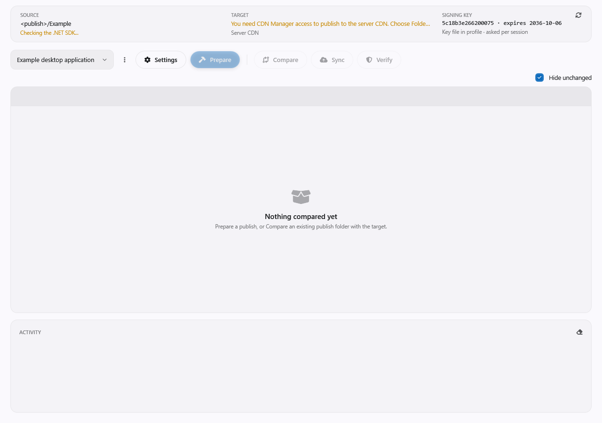

# Release Manager (WPF)

The **Release Manager** (`admin.release`, claim `Administrative Tools:Release Manager Access`) prepares the
desktop client releases installed by the launcher:

1. **Prepare** publishes the client into a local publish folder.
2. **Compare** compares that output with the published release.
3. **Sync** publishes and signs the release.
4. **Verify** checks the signature and every file.

The release layout follows the [release format contract](../release-format.md). Prepare requires the .NET
SDK 10. Publishing to the CDN also requires CDN Manager access.



## Profiles

A profile stores the solution/project source, the local publish folder, the destination and the signing
key choice for one application. Pick it from the leftmost combo box in the toolbar. The last profile is
remembered **per server address** (including a non-default port); without a connection the choice is
stored separately.

Default location: `Documents\Em\ReleaseManager\Profiles\Release`. **Profiles folder...** shows the path
with Browse, Copy path and Reset to default. Changing the folder only reads the new location; existing
files are not moved. **Open folder** opens the profiles folder.

```text
<ProfilesFolder>/<GUID-format-N>/
  profile.json
  signing.pfx  (optional, password-protected private key)
  signing.cer  (public DER certificate, no private key)
```

Example `profile.json` (use paths for your environment):

```json
{
  "formatVersion": 1,
  "id": "3f2a9c0e8b7d4a51b2c3d4e5f6a7b8c9",
  "name": "Example desktop",
  "solutionPath": "<workspace>\\Example.slnx",
  "hostProject": "src\\Example.Wpf\\Example.Wpf.csproj",
  "publishFolder": "<publish>\\Example",
  "targetKind": "Cdn",
  "targetFolder": "",
  "releaseFolder": "wpf-release",
  "signing": {
    "source": "ProfileFile",
    "thumbprint": "<certificate-thumbprint>",
    "passwordStorage": "Separate",
    "password": null
  }
}
```

The profile menu offers **New profile**, **Duplicate**, **Rename**, **Delete**, **Import...** and
**Export...**.

- Names must be unique, case-insensitively.
- Duplicate assigns a new ID and copies the key files, but not the DPAPI-protected password.
- A damaged profile folder is listed as invalid and cannot be selected.
- Without any profile, create or import one from the empty card; release operations are unavailable until
  then.

**Settings** edits a copy of the profile and Save writes it atomically. If `profile.json` changes on disk
while the dialog is open, the user chooses to overwrite or keep editing. Cancel discards setting changes.
Key operations (Create, Import, Remove key) take effect immediately and stay in effect after Cancel.

## Signing key and password

- **Windows certificate store** uses the thumbprint of an ECDSA P-256 key in `CurrentUser\My`, exportable or
  not.
- **Key file in this profile** uses `signing.pfx` with the public certificate `signing.cer`.

Verify and key information need no password; Sync needs the private key. Create and Import always ask for
the destination: **This profile** or **Windows certificate store**. Imported files are checked for the
password, the private key and the P-256 curve before they are copied.

The key file password has two modes:

- **Ask once per session** (Separate): the password stays in application memory. Tick **Remember on this
  PC** to store it with DPAPI CurrentUser in `LocalApplicationData\Em\ReleaseManager\Secrets\<id>.bin`,
  readable only by the same Windows user. **Forget remembered password** clears both the session and the
  encrypted file. A wrong password or damaged record is removed and asked again, up to three attempts.
- **Save as plain text in profile.json** (Plaintext): the password is written to the JSON. Anyone who can
  read or copy the profile folder can sign releases. **Set password...** validates the password before
  storing it in the draft. A stored wrong password must be fixed in Settings.

Switching from Plaintext to Separate on Save moves the password into the session and removes it from the
JSON. Switching from Separate to Plaintext uses the session/DPAPI password when available; otherwise use
Set password. **Export key** produces a `.pfx` with a new password. **Copy/Export public key** produces PEM
for the launcher. **Remove key file** deletes the profile's `.pfx`, `.cer` and password; keys in the
certificate store are never touched.

## Export, import and overlaps

Export produces one ZIP. **Include sensitive data?** defaults to **No**: only the JSON without a password
and the public certificate. **Yes** also includes the `.pfx` and a Plaintext password if present. Separate
and remembered passwords are never included.

Import accepts a ZIP or a loose JSON file. A conflicting ID can be imported as a new profile and a
conflicting name gets a number suffix. Archives with entries other than the three file names above are
rejected; each entry is limited to 10 MB. A profile without `.pfx` can still be imported; import the key
in Settings before Sync.

The same CDN destination, local release folder or local publish folder in two profiles triggers a warning
on Save. Prepare warns about a shared publish folder, and Sync about a shared destination and publish
folder. **No** cancels; **Yes** continues. The warnings do not grant exclusive ownership of those folders.

Delete removes only the profile's subfolder and its DPAPI/session password. The local publish folder,
published releases and the certificate store are left untouched.

## Migration from older versions

When the list loads for the first time and there is no valid profile, the seven older registry settings
are moved into a **Default** profile with a Store key source. The old values are removed after the JSON is
saved. If a valid profile already exists, the old values are left alone. The registry now keeps only the
profiles folder preference and the last profile per server. The migration is written to the activity
log.
