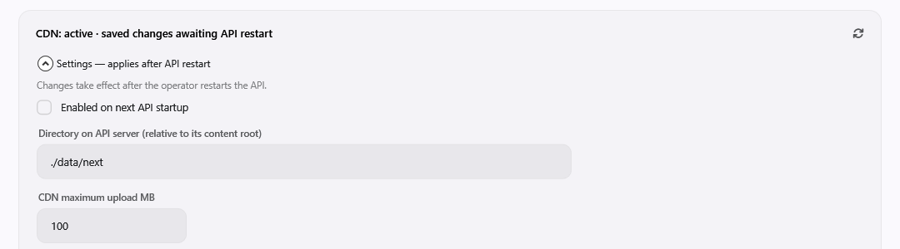

# Storage settings (CDN, container registry, NuGet)

With managed storage settings, operators enable, disable and relocate the CDN, container registry and
NuGet stores from the WPF managers instead of editing `Program.cs`.

```csharp
builder.AddManagedStorageSettings();
builder.AddNuPak();   // optional: the NuGet store also uses managed settings
```

Defaults on first start:

| Store | Enabled | Directory | Upload limit |
| --- | --- | --- | --- |
| CDN | yes | `./data/cdn` | 200 MB |
| Container registry | yes | `./data/container-registry` | n/a |
| NuGet | yes | `./data/nuget` | 250 MB (1–4096) |

Overloads accept a host ID and explicit defaults:
`AddManagedStorageSettings(hostId, cdn, registry)` and `AddManagedStorageSettings(hostId, cdn, registry, nuget)`.

Stored values are read before stores and middleware are created. **Save does not affect the running
server**: it does not swap the active snapshot, cancel tasks or move data. Changes apply after a normal API
shutdown and restart.

Managed mode cannot be combined with the static calls `EnableCdn`/`AddContainerRegistry` (or
`AddNuPak(path, maxPackageMb)`), and cannot be registered twice. Static hosts report `Managed=false`; the
UI does not offer Save and the API rejects it with 409.



## Persistence

The configuration is one JSON document in `ta_Meta.cMetaValue`, not a runtime file. The key is
`Em.StorageSettings:<SHA256(machine name + content root + hostId)>`, with `hostId` defaulting to
`default`. The key separates hosts sharing one database; it does not synchronize nodes.

- Machine name, content root and host ID must stay stable across deployments. If one changes, the
  operator copies the configuration row to the new key after checking that the paths suit the new host.
- Containers need a stable hostname and a persistent payload volume writable by the API account.
- The document contains `Version=1`, `Revision` and one section per feature with `Enabled`, `Directory`
  and `MaxUploadMb` (CDN and NuGet only). It holds no secrets.
- Defaults apply until the first Save creates the row. Save uses a serializable transaction and an
  expected revision. All features share one revision, so concurrent saves can return 409: refresh, then
  apply the draft again. Saving one feature keeps the others.
- An invalid row or unsupported version fails startup. Restore the row from a database backup or fix the
  JSON, then restart. Do not delete the row to reset it without recording the old paths.
- No new DDL is needed (`ta_Meta` already exists), but the core and registry schemas
  (`tables/010-core.sql`, `tables/030-registry.sql`) must exist before a managed startup, even when the
  registry is disabled. With NuGet, `tables/040-nupak.sql` and its views are required too.

## Claims and WPF screens

| Area | Manager/status claim | Settings claim (detail, Validate, Save) |
| --- | --- | --- |
| CDN | `CDN Manager Access` | `CDN Settings Manage` |
| Container registry | `Container Manager Access` | `Container Registry Settings Manage` |
| NuGet | `NuGet Manager Access` | `NuGet Settings Manage` |

All claims belong to module `Administrative Tools` and are granted in User/Role Manager. A manager claim
does not imply the settings claim; administrators follow the usual administrator rule. The general status
never includes server paths.

- Each manager has a **Settings** card that stays visible while the service is disabled.
- The small refresh button reloads the card's status and configuration; reloading over a draft asks for
  confirmation. Toggles only edit the draft.
- Save and Validate prevent duplicate requests. Conflicts are shown and the draft is kept until the user
  explicitly refreshes. Closing the panel or navigating away with unsaved changes asks for confirmation.
- The content area follows the API's active state, not the draft toggle. The home screen shows disabled
  and pending-restart states; a failed size read is shown as unavailable.
- MAUI has no storage manager screens.

## Directories and integrity

Paths are on the API server's filesystem, relative to `ContentRootPath`; they are not client folders.

- GET status/detail never creates folders. Validate probes the existing parent with a unique read/write
  test file, then removes it; a cleanup failure is reported. Saving an enabled store creates the needed
  directory. A disabled store may have an empty path; a non-empty path is still checked. Save never
  copies, moves or deletes payload.
- Paths may not pass through symlinks or reparse points. The CDN tree is also checked for links to other
  storage or configuration, and for known secret files (`emapi-config.json`, `em.local.json`,
  `secrets.local.json`, `.env*`, `.git`).
- Ambiguous Windows paths are rejected: trailing dot or space, device or reserved names, alternate data
  streams, short-name aliases.
- Stores may not overlap each other (ancestor/descendant), including the roots still active until restart,
  approval binary storage and the task cache. Inside the application directory only `data` may hold
  payload; binaries, configuration and the application root are rejected. Other hosts should use dedicated
  roots and never put secrets in the public CDN directory.

Registry specifics:

- Validate/Save of a new root, or re-enabling the registry, checks every blob in metadata (including
  retained or orphaned blobs) for size and SHA-256 in the target. An incomplete target is rejected.
- Existing upload rows block a root change; finish or cancel and clean up uploads first. Interrupted
  uploads are not guaranteed to resume.
- Startup repeats the blob check while managed registry storage is enabled, including the first start after
  a move. The Save check is not a lasting snapshot: concurrent pushes or manual changes are still possible
  afterwards, which is why startup checks again. Hashing all blobs can be slow on a large registry.
  Manifest metadata lives in the database.

## Maintainer notes

Harnesses kept outside the repo, run from the repo root:

- `dotnet run --project ..\.artefacts\em-system\scripts\storage-settings-smoke\StorageSettingsSmoke.csproj`
  uses a unique temp directory and an in-memory persistence fixture. Add `-- --sql` to create a unique
  SQL Server fixture database through the local connection; it tests `ta_Meta`, HTTP with a real user
  token, manager/settings claims, restart, CDN Range/upload, streaming upload while Save is pending, and
  OCI login/push/pull with robot grants, then drops only the database it created. It uses the engine's
  public dispatcher and mappings, not the production `Program.cs`, and is not a Docker CLI test.
- `dotnet run --project ..\.artefacts\em-system\scripts\storage-settings-render\StorageSettingsRender.csproj`
  renders the settings card enabled, disabled and busy in both themes without showing a window.
